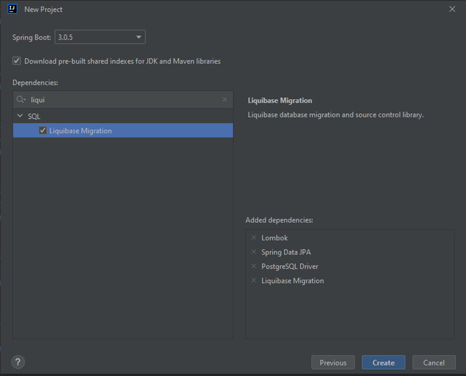
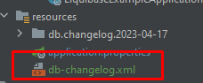

**1. Project Setup**<br>
When you starting setup project, you have to check this:

<br>
**2. Create db-changelog.xml**<br>
You have to create db-changelog.xml in you resource folder as show bellow: <br>
<br>
Example of db-changelog.xml: <br>

```xml 

<databaseChangeLog
        xmlns:xsi="http://www.w3.org/2001/XMLSchema-instance"
        xmlns="http://www.liquibase.org/xml/ns/dbchangelog"
        xsi:schemaLocation="http://www.liquibase.org/xml/ns/dbchangelog http://www.liquibase.org/xml/ns/dbchangelog/dbchangelog-3.1.xsd">
    <includeAll path="db"/>
</databaseChangeLog>
```

The above example allow liquibase to scan every catalog and file contained in db folder
<br>
**3. Setup your application.properties file** <br>

```properties
spring.datasource.url=jdbc:postgresql://localhost:5433/postgres
spring.datasource.username=postgres
spring.datasource.password=ye*if35X8yDA
spring.jpa.hibernate.ddl-auto=validate
spring.liquibase.enabled=true
spring.liquibase.change-log=db-changelog.xml
```

**4. Create migration file** <br>
<ol>
    <li>You have to find in your resource catalog db catalog</li>
    <li>You should create subfolder where the name of this folder will be current date</li>
    <li>In previously created catalog you should add you first migration file, like this 00-person.sql where 00 is meaning order of execution, and person is the name of table, which you want create</li>
</ol>
<br>
Bellow is example of your migration file: <br>

```sql
-- liquibase formatted sql
-- changeset mike.w:1
create table public.person
(
    id         bigint not null
        constraint pk_person
            primary key,
    first_name varchar(255),
    surname    varchar(255),
    birthdate  date
);
```

The above migration file contains two lines which are very important:
<ul>
    <li>The first give is a marker for liquibase (liquibase know that file is migration file)</li>
    <li>The second one contain author of changset and id of changeset</li>
</ul>

**5. Running a program**<br>
When you properly configured your application, liquibase read your migration file (or files) and will create in your database two tables (excluding your tables or other database stuff):
<ul>
    <li>databasechangelog</li>
    <li>databasechangeloglock</li>
</ul>
The first table is containing every change what you defined in your migration file (or files) with datetime of execution, author of changset, order of execute, type of migration file (in this example we perform sql migration) and many more data.<br>
The second one contain information about lock changset. If locked filed is set to true, application cannot run because liqibase cannot do everything. 